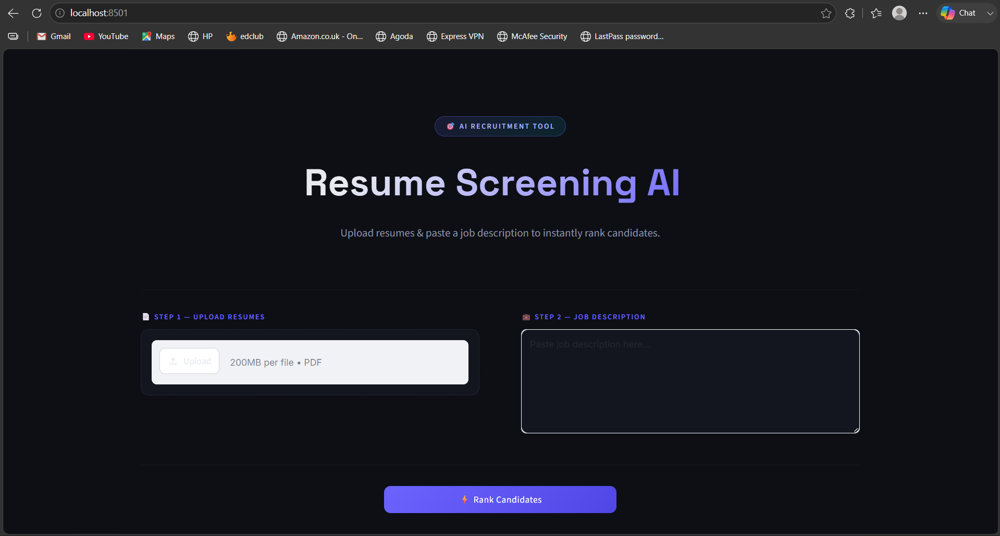
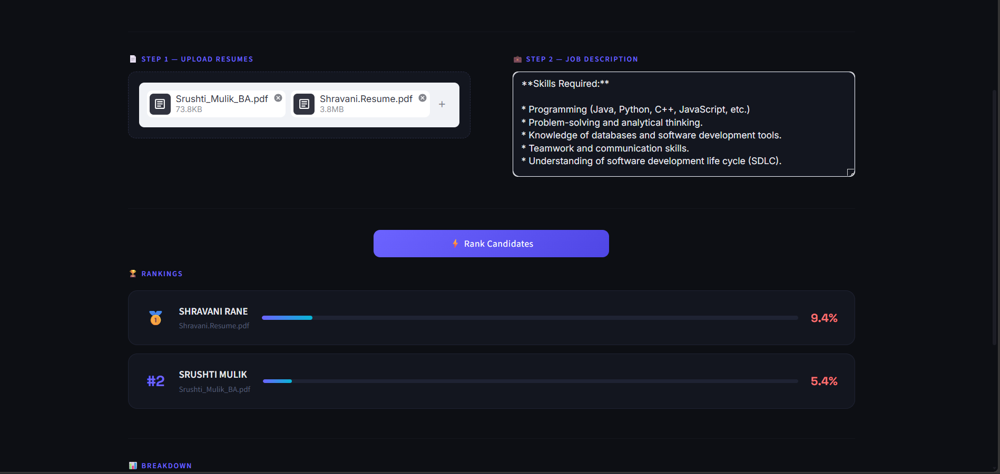
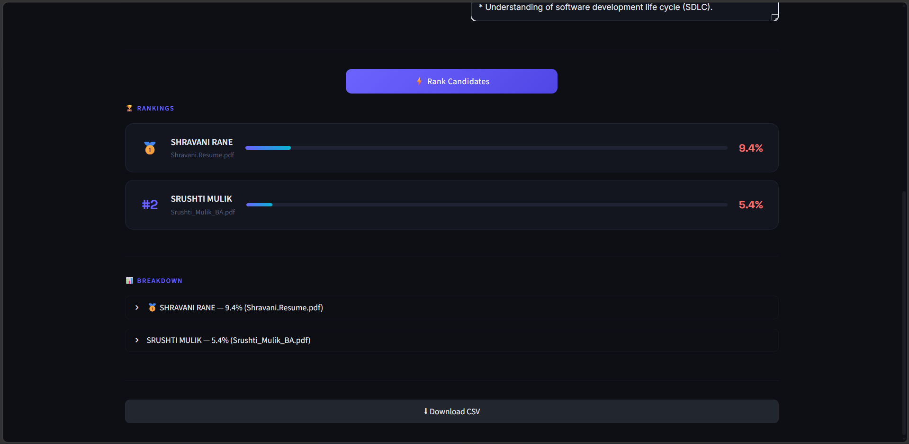

# Resume Screening AI

## Overview
Resume Screening AI is a web application that allows users to upload PDF resumes, compare them with a job description, and rank candidates based on their matching score using NLP techniques.

## Features
- Upload multiple PDF resumes
- Enter a job description
- Extract text from resumes
- Compare resumes with the job description
- Generate matching scores
- Rank candidates based on relevance

## Technologies Used
- Python
- Flask
- HTML, CSS, JavaScript
- Scikit-learn
- PyPDF2

## How to Run
1. Install the required packages:
   ```bash
   pip install -r requirements.txt
   ```
2. Run the application:
   ```bash
   python app.py
   ```
3. Open `http://127.0.0.1:5000/` in your browser.

## Conclusion
This project automates resume screening by matching uploaded PDF resumes with a job description and ranking candidates, making the recruitment process faster and more efficient.


demo screenshots :



